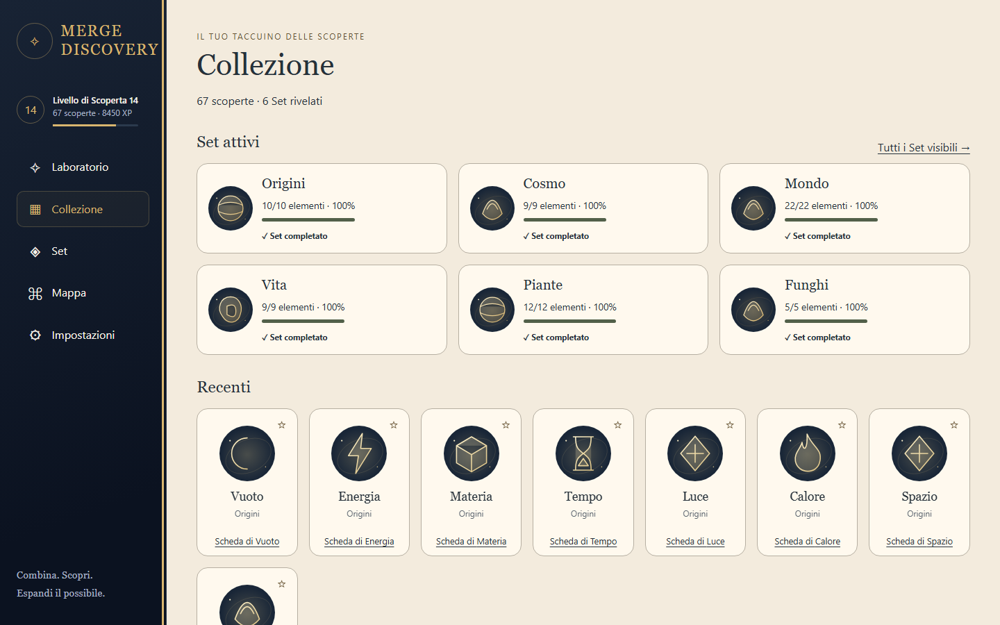
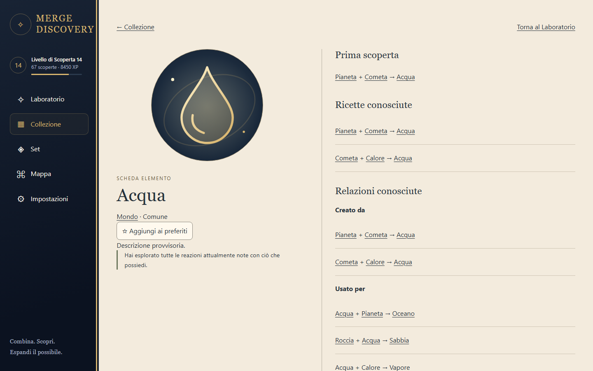
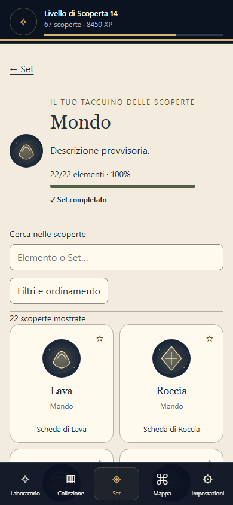
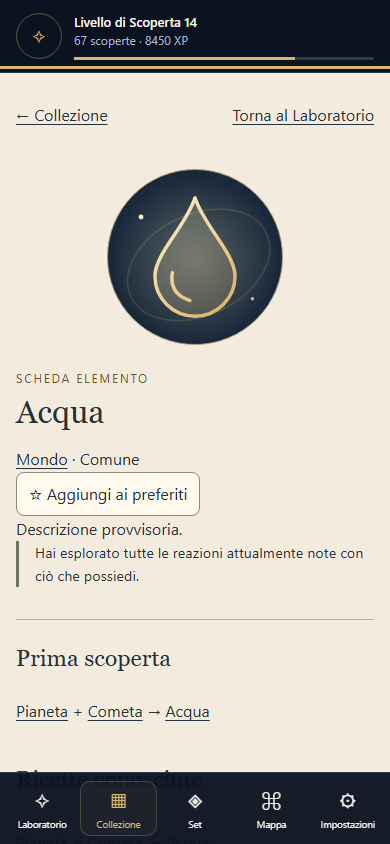
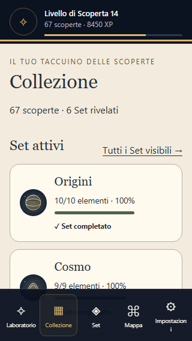

# Phase 4 — Collezione, Set e schede elemento

Implementato esclusivamente il task corrente di `CODEX_TASK.md`, entro Phase 4. Phase 5 non è iniziata. Contenuti canonici, ricette, gameplay, XP, tassonomia, unlock e schema del save invariati.

## Fonti e precedenze

Letti `AGENTS.md`, task e tutto il required reading: CATALOG_AND_DISCOVERY_GRAPH, SCREEN_SPECS, UX_SCREEN_ARCHITECTURE, RESPONSIVE_AND_UI_STATES, VISUAL_BIBLE_REFERENCE, VISUAL_DIRECTION, DESIGN_SYSTEM, ACCESSIBILITY, COPY_AND_LOCALIZATION, DATA_MODEL, SETS_AND_PROGRESSION, COLLECTIONS_AND_OBJECTIVES, HINTS_AND_FAILURE e PHASE_3_NOTES. Rispettati TECH_SPEC e le regole/spec applicabili delle fasi precedenti.

La Visual Bible guida atmosfera e gerarchia; gameplay, UX e contenuto canonico guidano comportamento e visibilità. Il taccuino usa i token carta avorio/inchiostro dentro la shell blu notte, con gli stessi placeholder SVG locali del Laboratorio. Nessun asset finale o nuovo contenuto.

## Routing e fonti di verità

React Router gestisce `/` (Laboratorio), `/collection`, `/sets`, `/sets/:setId`, `/elements/:elementId` e la destinazione `/settings` esistente. I pulsanti della navigazione progressiva cambiano URL e cronologia; i collegamenti del catalogo supportano deep link e reload. La navigazione continua a usare le soglie Phase 3. Mappa/Anomalie già visibili rimangono esplicitamente schermate future.

`src/app/App.tsx` mantiene il Laboratorio montato durante la navigazione: slot, ricerca e risultato non si perdono. Solo un risultato salvato offre l'azione esplicita **Vedi scheda**, senza navigazione automatica. Il focus passa al main della nuova destinazione senza tagliare l'header mobile; i preferiti non spostano il focus.

Un elemento non posseduto o un Set non visibile restituisce la stessa pagina generica **Non ancora scoperto**, anche per ID inesistenti, senza nome, descrizione, rarità, Set o ricette. I Set annunciati consentiti dalla proiezione esistente mostrano nome e lucchetto, senza denominatore o indizi inventati. Il seed non contiene indizi appositi o stati glimpsed da riempire: le griglie mostrano soltanto elementi posseduti, senza sagome o slot nascosti.

Il save Phase 2 è l'unica verità durevole. Collezione, Set, scheda e Laboratorio scrivono i preferiti tramite `SaveApplication.updatePreferences`, quindi validazione, revisione, backup e commit restano identici. Nessun nuovo store o schema.

## Selettori e possibilità

`src/application/catalog.ts` prepara indici immutabili per Set, ricette e regole; memorizza la proiezione per snapshot e le schede per ID. La UI filtra/ordina solo DTO sicuri e non legge contenuto o resolver. Nessuna scansione delle ricette su ogni render.

- Set visibili e completamento vengono dalla proiezione di visibilità già usata dallo snapshot. Un completamento guadagnato resta riconosciuto anche se un'espansione rende incompleto il denominatore corrente; nessun premio viene assegnato dalla UI.
- Recenti: otto elementi ordinati per `firstDiscoveredAt`, con ordine canonico come spareggio. Nessun totale globale del catalogo.
- Marker **Nuove possibilità**: soltanto ID posseduti della riconciliazione esistente; badge Set soltanto attraverso membri posseduti.
- Ricette/relazioni: soltanto ID scoperti e input/risultati posseduti. Prima ricetta da `firstRecipeId`; i concetti iniziali hanno stato dedicato. Se il save non contiene la prima ricetta, il testo lo dichiara senza ricostruirla.
- Possibilità/esaurimento: valutazione deterministica del resolver su coppie autoriali con input posseduti e regole sbloccate. Le regole generano candidati dai rispettivi selettori, non una matrice globale salvata. Esclusi risultati/ricette segreti non rivelati, Set nascosti non rivelati, gate dormienti e modalità future non accessibili, in coerenza con la prudenza della riconciliazione Phase 2. Nessun partner o risultato sconosciuto viene restituito alla UI.
- Un vecchio fallimento non diventa una prova permanente di esaurimento. La sua autorità usa la stessa verifica Phase 2; un gate segreto appena eleggibile non crea un marker visibile nella versione corrente.
- Esperimenti: solo coppie già salvate e partner posseduti, raggruppati in Successi/Anomalie/Nessuna reazione. Nessun elenco di partner non provati. Le anomalie osservate mostrano coppia/stato; un'eventuale rivisitabilità è generica e non espone il risultato.

Componenti in `src/ui/catalog/Catalog.tsx`: CollectionHome, SetCard, SetIndex, SetDetail, ElementDetail, CatalogSearch, FilterPanel, CompletionBar, PossibilityStatus, ExperimentHistory e RelationshipList. Riutilizzati AppShell, navigazione, ElementCard, ElementArt e stelle save-backed. `src/styles/catalog.css` mantiene gli stili delle nuove pagine separati dal Laboratorio.

## Responsive e accessibilità

Verificati 320×568, 390×844, 768×1024, 1024×768, 1440×900 e 1920×1080. Griglie Set a 4–6 colonne desktop, 2 mobile; scheda editoriale a due colonne desktop e pagina completa mobile. Una sola pagina scorrevole su mobile; controlli catalogo sticky su desktop.

Filtri mobile come pannello espandibile non modale: focus al primo select, Escape/Chiudi restituiscono focus al pulsante, valori conservati sul resize. Landmark, heading, link da tastiera, progressi con etichette/valori, stelle con stato premuto, stato descritto a parole e target ≥44 px. Aggiunto il titolo accessibile della shell mobile. Nessun overflow a testo 200%; contrasto elevato e testo Molto grande verificati sulle nuove pagine. Movimento ridotto/forced colors riusano le regole esistenti.

## Comandi e verifiche

```sh
npm ci
npm run dev
npm run check
npx playwright install chromium
npm run test:e2e
npm run validate:content
npm run simulate:content
npm run profile:catalog
```

`check` include typecheck, lint, Vitest e build; build esegue validator e simulatore. CI Node 22 esegue check, profiling e tutti gli E2E Chromium.

Risultati della consegna: 111 test Vitest, inclusi i 98 preesistenti; 8 E2E, inclusi i 4 del Laboratorio. Validator: 67 elementi, 64 ricette, 6 Set, 4 collezioni e 1 anomalia validi. Simulazione: **67/67 raggiungibili**, profondità massima 11, nessun elemento richiesto irraggiungibile, Set non rivelato o unlock bloccato. Axe: nessuna violazione su Collezione e scheda, desktop e mobile con preferenze accessibili.

Profiling riproducibile in memoria (non modifica seed/save): 1.000 elementi, 64 ricette autoriali; ultima misura locale circa 133 ms per la proiezione e 2 ms per 1.000 accessi cache/schede. Nessuna virtualizzazione necessaria per il seed da 67; i DTO e le liste permettono di aggiungerla se il catalogo futuro la richiederà. Questo è uno smoke test dei selettori, non una misura di rendering di un catalogo finale.

## Screenshot

Prodotti dagli E2E attraverso l'import Phase 2 con preview e conferma della fixture `v1-completed-sets`, senza iniettare conoscenze nella UI. Tutti i percorsi mostrati sono registrati nel save importato; Acqua ha due ricette conosciute.







Gli E2E rigenerano anche l'evidenza del Laboratorio Phase 3; il desktop ora include **Vedi scheda**. Nessuna registrazione video.

## Problemi, limiti e scope

Nessuna contraddizione di design irrisolta. Descrizioni e arte restano provvisorie come nei contenuti canonici. Build riuscita con i warning già presenti sulle annotazioni Zod e sulla dimensione del bundle; React Router porta il bundle iniziale a circa 564 kB minificati / 172 kB gzip. Nessuna soglia o regola di gameplay è stata adattata per nascondere warning.

Fuori scope e non implementati: flusso collezioni tematiche/obiettivi/pinning, archivio Anomalie e UI di rivisitazione, mappa grafica, suggerimenti/Risonanza, PWA/offline, Android, artwork finali, audio, backend/cloud, monetizzazione e analytics. **Scope non esteso oltre Phase 4; Phase 5 non iniziata.**
