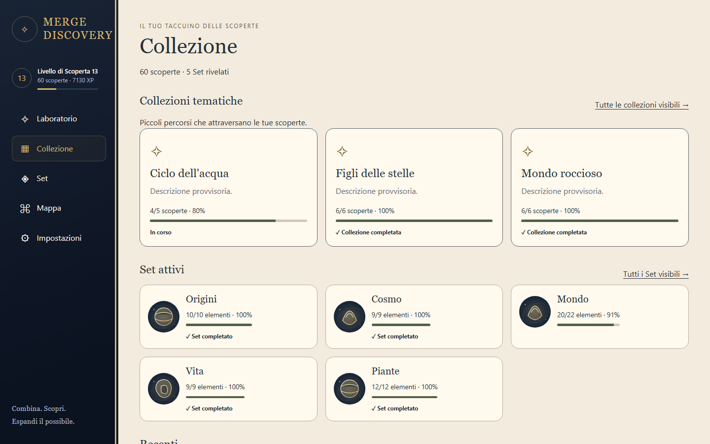
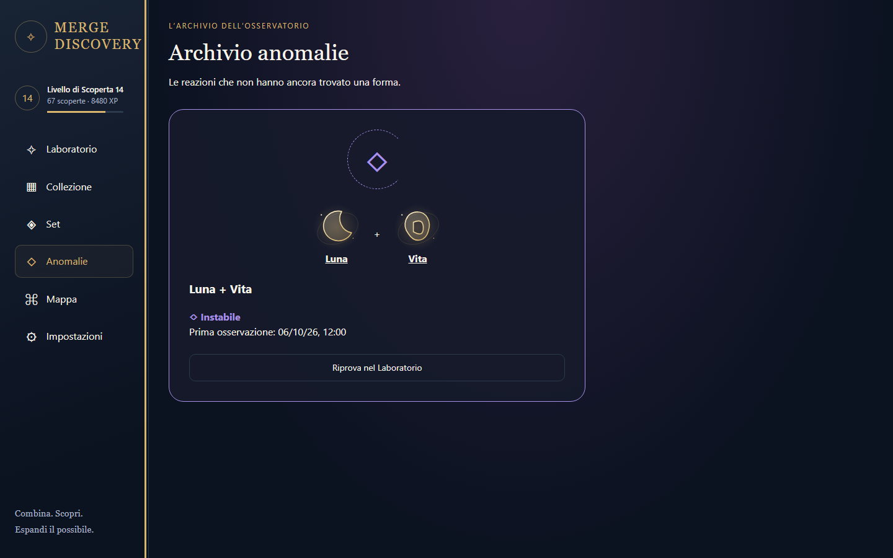
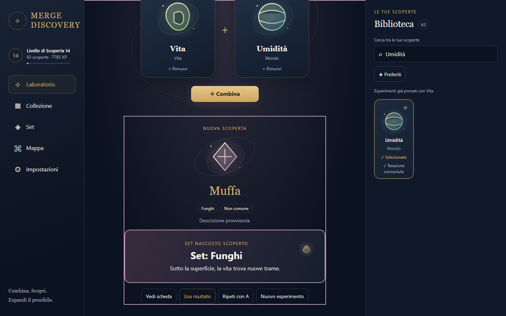
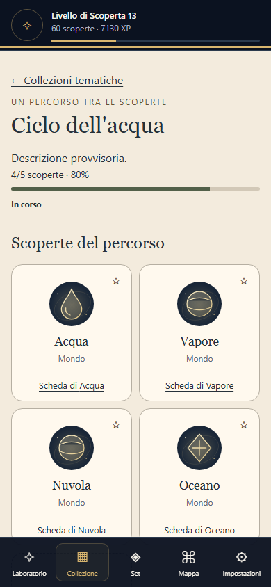
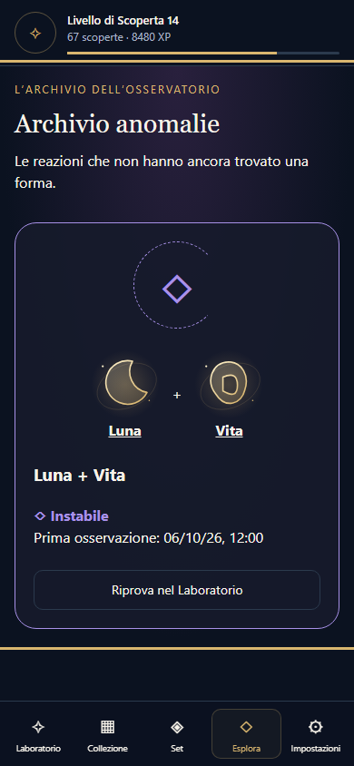
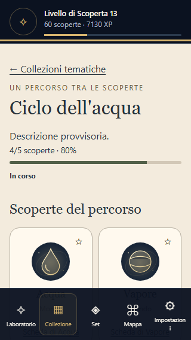

# Phase 5 — Disclosure, Archivio anomalie e Collezioni tematiche

Task limitato a `CODEX_TASK.md` Phase 5. Laboratorio Phase 3 e Catalogo/Set/Schede Phase 4 conservano lo stesso controller, contenuto canonico, save e preferiti. Nessuna modifica a ricette, gameplay, XP, tassonomia, unlock o schema v1. Phase 6 non iniziata.

## Fonti e architettura

Letti prima dell'implementazione `AGENTS.md`, task e tutti i required reading: IMPLEMENTATION_PLAN, COLLECTIONS_AND_OBJECTIVES, CATALOG_AND_DISCOVERY_GRAPH, SCREEN_SPECS, UX_SCREEN_ARCHITECTURE, FIRST_SESSION_EXPERIENCE, VISUAL_BIBLE_REFERENCE, DESIGN_SYSTEM, MOTION_AUDIO, ACCESSIBILITY, DATA_MODEL, RESOLUTION_ENGINE, SAVE_AND_VERSIONING, IMPLEMENTATION_SEED_CONTENT e PHASE_4_NOTES. Applicati TECH_SPEC, decisioni canoniche e specifiche responsive/validazione. Direzione visiva della Design Bible, comportamento e contenuti delle specifiche repository.

- `src/domain/completion/collections.ts`: funzioni pure per reveal autoriali, membri eleggibili, progressi e nuovi completamenti; condivise dalla proiezione di visibilità. Membri ritirati, segreti e Set non rivelati senza conoscenza posseduta non aumentano il denominatore. Nessun membro mancante restituisce identità alla UI.
- `src/domain/progression/state.ts`: evento deterministico `collection_completed`, proiettato una sola volta per unità; nessun premio XP o altro. Senza capitoli l'ID durevole è `collection.id`; con capitoli sono gli ID autoriali dei capitoli. Il validator impedisce collisioni globali fra gli ID delle unità.
- `src/application/save/projection.ts` e `updates/reconcile.ts`: riuso di `completedCollectionChapterIds`; persistenza nel commit atomico esistente. Un badge già guadagnato resta valido quando la stessa unità si espande. Caricamento/import/riconciliazione aggiungono completamenti visibili già maturati senza XP, nuovi reveal, evento fittizio o celebrazione. Riferimenti ritirati restano nella quarantena Phase 2.
- `src/application/disclosure.ts`: una funzione condivisa da navigazione, guardie delle rotte e link contestuali. Collezione dopo tre scoperte oltre i quattro starter; Set dopo il primo nuovo Set; Anomalie dopo osservazione; Mappa dopo 15 elementi posseduti. Schede possedute consentite prima del catalogo; Set mostrato come testo quando il browser Set è ancora bloccato. Rotte di feature bloccate restituiscono una pagina generica; ID non rivelati restano genericamente non scoperti.
- `src/application/world.ts`: mappe del contenuto create una volta, DTO memorizzati per snapshot. Solo Collezioni visibili e membri posseduti; conteggio anonimo dei mancanti. Ordinamento per progresso tra le incomplete, badge guadagnati in fondo. Nessuna matrice di coppie o verità di visibilità duplicata nel save.
- `src/app/App.tsx`: composizione di rotte e azioni; Laboratorio resta montato. `/collections`, `/collections/:collectionId`, `/explore/anomalies`; `/anomalies` è alias con redirect. Esplora raggruppa Archivio reale e Mappa placeholder soltanto se disponibili, mantenendo massimo cinque destinazioni mobile.
- `src/ui/collections`, `src/ui/anomalies`, `src/styles/world.css`: taccuino avorio per Collezioni; vetro scuro, viola e orbita incompleta statica per Archivio. ElementCard/ElementArt e preferiti sono quelli esistenti.

## Archivio e retry

L'Archivio proietta soltanto anomalie osservate con entrambi gli input posseduti e prima data di osservazione locale. Non restituisce categoria interna, requisiti, ricetta futura o risultato irrisolto.

Instabile: resolver ancora anomalo. Inerte: coppia attualmente inattiva. Riesaminabile: ricetta autoriale di risoluzione non segreta, attualmente eleggibile e consentita dalla stessa prudente policy di visibilità; testo generico **Qualcosa è cambiato.** Risolta: fatto di risoluzione salvato; link risultato solo se anche la ricetta risolutiva è conosciuta e l'elemento posseduto. Il seed Luna + Vita rimane irrisolto; gli altri stati sono verificati con contenuto sintetico esclusivamente nei test.

**Riprova nel Laboratorio** sostituisce entrambi gli slot con gli input noti, azzera il risultato precedente, sposta il focus al main del Laboratorio e annuncia la coppia. Non combina automaticamente e non scrive il save. Il successivo Combina usa la pipeline atomica Phase 2.

## Gerarchia, responsive e accessibilità

Una sola superficie risultato, con priorità conosciuto < alternativa < nuova scoperta < Collezione < Set normale < Set nascosto/segreto < anomalia. Gli eventi secondari restano leggibili; nessuna pila di modali. Una sola regione live annuncia le informazioni composte dopo il commit. Nuove Collezioni sono confrontate fra snapshot visibili precedente/successivo, senza stato persistente aggiuntivo; completamenti multipli occupano un unico blocco compatto.

Vita + Umidità → Muffa rivela Funghi come Set nascosto: accento canonico temporaneo, motivo SVG locale, bordo più forte e breve linea tematica. La distinzione usa `Set.visibility`, `accentToken` e `iconKey`, mai il nome tradotto. Reset/nuovo esperimento termina l'ambiente temporaneo. Movimento ridotto conserva tutte le informazioni senza animazioni.

Verificati 320×568, 390×844, 768×1024, 1024×768, 1440×900 e 1920×1080; contrasto elevato, testo Molto grande, testo 200%, reduced motion e forced colors. Link e pulsanti semantici, controlli ≥44 px, progressi etichettati, slot mancanti anonimi, stato espresso a parole, nessun overflow. La ricerca opera solo sui nomi delle Collezioni già visibili. Le preferenze accessibili rimangono quelle del save condiviso.

## Verifica e comandi

```sh
npm ci
npm run dev
npm run check
npx playwright install chromium
npm run test:e2e
npm run validate:content
npm run simulate:content
npm run profile:catalog
npx tsx scripts/generate-phase5-fixtures.ts
```

`check` comprende typecheck, lint, Vitest e build con validator e simulatore. CI Node 22 esegue check, profiling e E2E Chromium. Le due fixture Phase 5 sono generate dal vero `SaveApplication` in memoria tramite combinazioni canoniche; gli screenshot le caricano tramite import preview e conferma. Le prove Phase 3/4 vengono eseguite integralmente; il test precedente di deep link guadagna ora legittimamente le soglie richieste prima di aprire il catalogo.

Risultati della consegna: **133 test unitari/componenti** in 7 file, inclusi tutti i 111 precedenti; **14 E2E**, inclusi tutti gli 8 precedenti. Validator: 67 elementi, 64 ricette, 6 Set, 4 Collezioni e 1 anomalia validi. Simulazione: **67/67 raggiungibili**, profondità massima **11**, zero richiesti irraggiungibili, zero Set non rivelati, zero unlock bloccati, quattro unità Collezione completate e una anomalia osservata/irrisolta. Nessun contenuto canonico alterato.

## Screenshot

Evidenze dirette del prodotto generate dagli E2E. Lo screenshot Funghi scorre la superficie risultato per mostrare insieme scoperta e reveal; nessun montaggio o overlay. Nessuna registrazione video. Rigenerate anche le evidenze precedenti; la Home Phase 4 include ora la sezione tematica richiesta.








## Problemi e confini

Nessuna contraddizione di design irrisolta. Descrizioni e arte restano i placeholder canonici. Persistono i warning già presenti di Rollup/Zod e bundle oltre 500 kB; build riuscita. Nessuna modifica alle soglie per mascherarli.

Non implementati: mappa/graph canvas, hint/Risonanza, pinning di obiettivi, nuovi campi save o contenuti, ricompense per Collezioni, risoluzione Arcano, achievement, PWA, Android, asset/audio finali, backend/cloud, monetizzazione o analytics. **Scope non esteso oltre Phase 5; Phase 6 non iniziata.**
