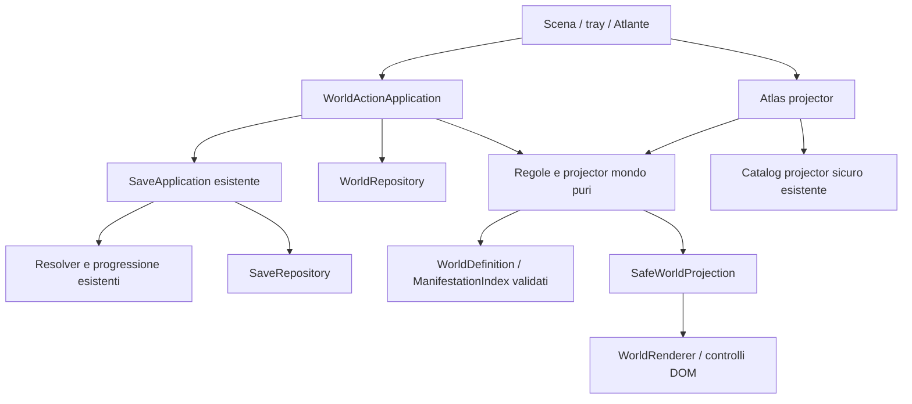

# ADR proposto — Isolario + Atlante Vivente

Data: 2026-10-09. Stato: **PROPOSTA PER APPROVAZIONE**, non decisione implementata.
Audit soltanto. Nessuna modifica al canone, ai runtime o alle PR #9–16; nessun merge. La proposta di migrazione e il CODEX_TASK corrente su main prevalgono sui task FreeTable archiviati.

## 1. Raccomandazione

Ripartire dalla base tecnica, **non da zero**: main `39c62ada194651d27c153d3be5d5444fc3c27ce8`, con dominio, seed, salvataggi, projector di conoscenza e PWA intatti. Aggiungere una scena spaziale e il suo stato persistente dietro nuove interfacce. Estrarre selettivamente dai draft le parti necessarie; non ereditare l'AppShell a tre dashboard o fare di FreeTable un'isola con uno sfondo.

Per il primo prototipo raccomando un diorama 2.5D a camera fissa, raster illustrati su SVG e controlli DOM accessibili, poche aree con ancoraggi validi, scelta esplicita del giocatore su dove manifestare una scoperta. Atlante in una scheda ampia con pagine reali, apribile dalla scena; su telefono occupa la schermata e restituisce il focus alla chiusura. Nessun nuovo motore di ricette, economia, attesa o simulazione biologica.

Tre decisioni da approvare prima dell'implementazione:

1. **Scena**: 2.5D inclinata/isometrica dipinta, camera fissa, leggibile a 320px. Non bloccare uno stile definitivo prima di una composizione campione PC/mobile.
2. **Agency**: essenza scoperta → azione → scelta fra ancoraggi compatibili → trasformazione. Esperimento separato in un tray A+B con Combina esplicito; drag aggiuntivo soltanto. Niente spawn automatico di tutte le scoperte.
3. **Viaggio**: 20 scoperte nuove + quattro starter, dieci trasformazioni proposte, luce/acqua/terreno/flora/una creatura. Primo Atlante di conoscenza e cronaca. Pioggia/vento fuori da questo percorso, non ottenuti artificialmente.

## 2. Evidenza dell'audit

Fonti: AGENTS, CODEX_TASK e `proposals/ISOLARIO_ATLANTE_MIGRATION.md` da main; TECH_SPEC, DATA_MODEL, RESOLUTION_ENGINE, SAVE_AND_VERSIONING, DECISIONS, GAME_VISION, VALIDATION_AND_TESTING, seed; specifiche visuali/responsive/accessibilità/motion; codice core e differenze dei branch elencati sotto. Il poster storico resta riferimento per identità navy/oro e qualità illustrata, non per composizione della nuova scena.

Verifica GitHub del 2026-10-09, con SHA fissati in `../evidence/isolario-architecture/pr-snapshot.json`. Tutte aperte e non merged; #9 non draft, #10–16 draft. Questo stato non costituisce approvazione. I numeri di test pubblicati nelle vecchie PR non sono stati rieseguiti su ogni head durante questo audit.

| PR / head | Base attuale | Recuperare | Non trascinare nel prototipo |
| --- | --- | --- | --- |
| #9 `c22cbe35` | main | token navy/oro, ElementArt, componenti condivisi, adattamenti contrasto/target | AppShell/Lab come struttura primaria; screenshot come design finale |
| #10 `46a5478a` | #9 | composizione editoriale, componenti di dettaglio/ricette, test anti-spoiler | layout completo catalogo/Set; merge intermedi di main |
| #11 `682b4765` | #10 | mappa locale e lista accessibile, Anomalie/Settings come supporto | mappa di ricette trasformata in geografia, navigazione dashboard |
| #12 `0225bdd4` | #11 | dossier come materiale di review futuro | attivazione delle 51 proposte 8A; nessuna dipendenza per Creatura |
| #13 `2267a444` | #11 | `attempt.ts`, `librarySearch.ts`, recenza/hintSession e relativi test | FreeTable/Laboratory e controlli prima del mondo |
| #14 `85d7a214` | #13 | ZIP/schema/composizione/preview, repository atomico, immagini verificate, worker/lease | App.tsx intero, sample/dossier attivo, importer obbligatorio nella prima isola |
| #15 `be21cbe0` | #14 | authoring/bozze/Studio lazy, export, test offline; fix forced-colors isolato se pertinente | nuova UI autore nel primo prototipo; rollback senza controllo dei riferimenti del mondo |
| #16 `3afcb5a9` | #13 | capture/soglie/cancel, tap senza click compatibile, visualViewport, safe-point PWA e test dei replay | figura=icona sul tavolo, percentuali FreeTable, CSS/root route/chrome; seconda alternativa fixture |

### Moduli già presenti su main

| Sistema verificato | Destino |
| --- | --- |
| `domain/resolver/{resolve,pair,rules}`, progression/completion, simulation | riuso diretto, stesso A+B unordered e A+A authored; mondo non è un modifier della ricetta |
| `content/{data,schemas,indexes,validate,load}` | seed 67/64/6/4/1 intatto; mapping mondo separato, non nuovo campo obbligatorio in ogni ElementDefinition |
| `application/save/{SaveApplication,projection,migrations}`, updates/reconcile | unica autorità di conoscenza/XP; commit prima del feedback |
| `persistence/{SaveRepository,snapshots}`, memory/IndexedDB | mantenere CAS, current/backup, import/export e recupero; estensione limitata per ciclo di vita del mondo |
| `application/catalog.ts`, laboratory.ts, directions/disclosure, domain/visibility | DTO posseduti, dettagli e ricette note dell'Atlante; controlli visibility condivisi |
| `application/world.ts` | **oggi solo Collections/Anomalies**, non WorldState spaziale. Riutilizzare come projector di conoscenza; nuovo namespace `application/island` senza sostituirlo |
| application/map, hints, UI Settings/Recovery/UpdateNotice | strumenti secondari; niente nuovi indizi esatti tramite zone/scene |
| platform/pwa + audio | mantenere aggiornamento esplicito, precache/versioni, audio opt-in e reduced motion |

Main non include importer/Studio, né il command lease aggiunto da #14. `SaveApplication` serializza una coda **per istanza**: non garantisce da sola la coerenza tra schede o fra save e mondo. Gli adapter usano revisioni, ma due DB distinti non costituiscono una transazione unica. `visibleElements` può includere elementi announced non posseduti: per azioni/Atlante usare il catalogo posseduto, non quel selettore isolatamente. I cache WeakMap per ApplicationSnapshot non coprono nuovi commit del mondo: servono chiavi composite.

TECH_SPEC suggerisce Zustand, ma il runtime verificato usa React state e snapshot/projector; non occorre introdurre una nuova libreria di store per l'isola. Il contratto di snapshot può rimanere indipendente dalla scelta del suo subscriber UI.

`ElementArt` usa SVG simbolici/fallback e, su #14, Blob raster per icone. Non contiene pivot, footprint, profondità o animazioni di scena. Non basta ingrandirlo per ottenere un diorama illustrato.

## 3. Confini e contratti proposti



Il renderer riceve DTO safe e callback d'intento; non riceve ContentIndex, PlayerSave grezzo o mapping completo. Persistence non dipende da React. Regole del mondo in puro TypeScript; il dominio del mondo consuma fatti di conoscenza, non SaveApplication né browser.

### Definizioni authored, diverse dai fatti del giocatore

```ts
type WorldDefinition = {
  id: string; version: string; coordinateSpace: { width: number; height: number };
  zones: { id: string; labelKey: string; anchors: {
    id: string; x: number; y: number; depth: number; tags: string[];
  }[] }[];
  baseArtKey: string;
};
type WorldRequirement =
  | { type: 'owned'; elementId: string }
  | { type: 'manifested'; manifestationId: string; zoneId?: string }
  | { type: 'habitat'; tag: string; zoneId: string };
type ManifestationDefinition = {
  id: string; sourceElementId: string; worldId: string;
  kind: 'terrain' | 'environment' | 'living_object';
  target: { zoneIds: string[]; anchorIds: string[]; slot: string };
  requirements: WorldRequirement[];
  replaces?: string[]; maxInstances: number;
  labelKey: string; observationKey: string; artKey: string;
  animationKey?: string;
};
```

ID snake_case stabili. ManifestationIndex indicizzato per sourceElementId/zone/slot. Vecchi Requirement di livello/Set restano in ContentIndex: non inventare gate del resolver. Prerequisiti spaziali valgono solo per manifestare, non per scoprire. `maxInstances=1` per slot nella prima isola; essenze infinite, nessuna spesa. Sostituzioni esplicite non sono ricette di upgrade. Elementi unmapped: pienamente validi nell'Atlante, nessun oggetto finto.

Validator separato: schema strict, ID/locale/art/zone/anchor/element references, numeri finiti/bounds, max/slot, sostituzioni non ambigue, cicli di prerequisiti, mapping raggiungibile con il percorso canonico. Nessuna zone→Set correspondence. Una fixture hidden/secret verifica che mapping e requisiti non appaiano prima della conoscenza ammessa.

### WorldState persistente, WorldProjection derivata

```ts
type Placement = {
  id: string; manifestationId: string; zoneId: string; anchorId: string;
  kind: 'terrain' | 'environment' | 'living_object';
  variantId: string; committedAt: string;
};
type WorldObservation = {
  id: string; mutationId: string; sequence: number;
  manifestationId: string; zoneId: string; committedAt: string;
};
type WorldState = {
  worldSchemaVersion: 1; definitionVersionSeen: string;
  profileGeneration: string; worldId: string;
  unlockedIslandIds: string[];
  placements: Record<string, Placement>;
  observations: WorldObservation[];
  appliedCommands: Record<string, { payloadHash: string; mutationId?: string }>;
};
type WorldSlots = { revision: number; current: unknown | null; backup: unknown | null };
interface WorldRepository {
  load(worldId: string, profileGeneration: string): Promise<WorldSlots>;
  commit(request: {
    worldId: string; profileGeneration: string; expectedWorldRevision: number;
    expectedSaveRevision: number; next: WorldState;
  }): Promise<number>;
  exportRaw(worldId: string, profileGeneration: string): Promise<unknown>;
}
```

Interfacce sono bozze, non nuovi file runtime. All'interno il commit atomico valida la generazione e la revisione **attuali** del save, oltre alla revisione mondo. WorldState non duplica XP, ricette, contenuto degli elementi, completamenti, posizione frame della creatura o flag di habitat derivabili. Ambiente e terreno sono placements in slot differenti; habitat/scene summary/azioni disponibili sono derivati dai fatti e dal mapping. Camera, query, selezione, ghost e animazioni restano locali; impostazioni di accessibilità continuano a venire da PlayerSave. L'isola singola non richiede una nuova progressione di sblocco.

`appliedCommands` conserva gli ID dei comandi realmente mutanti (massimo dieci nel prototipo monotono); no-op non allungano il registro. Una futura cronaca libera richiederà una policy di compattazione, non una lista senza limiti. Ogni nuovo comando riutilizzato deve avere lo stesso payload; altrimenti errore tipizzato. `sequence`, non l'orologio, ordina osservazioni e revisioni.

### Persistenza, import e reset: la scelta importante

**Raccomandazione**: WorldRepository separato logicamente, store additivi `world_snapshots` e `profile_meta` nello **stesso DB Dexie del save**, versione IndexedDB 2. PlayerSave/saveSchemaVersion ed export canonico restano v1. Gli store del mondo hanno schema proprio. Copie separate del DB nel playground di sviluppo permettono test senza toccare il progresso personale.

Motivo: un DB del mondo totalmente indipendente è semplice finché nessuno importa/resetta un save. PlayerSave non ha un'identità di partita affidabile; `createdAt` e un hash delle scoperte non bastano, soprattutto con import identici. `profile_meta.generation` cambia atomicamente nelle transazioni create/import/reset del SaveRepository; nessun campo nuovo nel PlayerSave. World commit legge gli store save/meta/world nella stessa transazione, impedendo placement con una snapshot o una partita superata. Preferences/combine non cambiano generation. Un import isolato del vecchio JSON crea una nuova generazione mondo vuota dopo conferma esplicita; i vecchi world slot restano recuperabili/esportabili secondo backup limitato, non vengono associati al save nuovo.

Questa è una **migrazione del contenitore IndexedDB proposta**, da approvare e testare; non fingere che sia già disponibile nel codice. Aggiornamento da v1 preserva snapshots/current/backup byte per byte e crea metadata solo al primo accesso. Gestire `versionchange`/upgrade bloccato e richiedere reload alle vecchie schede. Non cancellare un DB corrotto. Backup mondo separato non cambia il backup canonico. Recupero di un save precedente verifica di nuovo possesso e mapping, e mette fuori proiezione placements non più legittimi senza distruggere dati raw.

Comandi mondo serializzati/lease tra schede; dalla #14 recuperare pattern `CommandLease` e Web Locks, evitando lease annidati non reentranti. Il command CAS salva comunque da race; senza Web Locks, content installation futura resta disabilitata come nel modello #14. Una pair experiment delega a SaveApplication (che acquisisce il proprio lease), **non** chiama SaveApplication da dentro lo stesso lock già acquisito.

### Transazioni e sicurezza dei retry

1. Esperimento nel tray/oggetto: usa solo due essenze possedute e SaveApplication.combine. Lo stato dell'isola non cambia il PairKey né il risultato canonico.
2. Dopo il commit, pubblica la nuova conoscenza e l'azione disponibile; il giocatore sceglie quando/dove applicarla. Nessuno spawn automatico.
3. `WorldActionApplication.manifest(commandId, manifestationId, anchorId, revisions)` carica snapshot correnti, applica un reducer puro, valida e committa placement+osservazione+receipt atomicamente. Niente XP.
4. Animazione e pagina Atlante vengono proiettate **dopo** quel commit. Fallimento mondo: scoperta resta valida, scena e cronaca non fingono una trasformazione; stessa azione riprovabile. Fallimento discovery: nessuna azione sbloccata.
5. Crash fra 1 e 3: è una scoperta ancora non manifestata, non una transazione da annullare; al reload il comando resta disponibile, senza doppio XP/effetti.
6. Retry dello stesso ID o nuova richiesta dello stesso stato già attivo: no-op, nessuna nuova osservazione/revisione. Cambio target o variante è una mutazione solo se authored, non una cache per coppia eterna.

L'idempotenza dei replay canonici può riusare l'algoritmo `rememberedAttempt` #13: oggi restituisce LabReaction, quindi estrarre un risultato applicativo neutro con wrapper di presentazione Lab, non importare la UI nel dominio del mondo. Alternative nuove/stale/anomalie ripercorrono SaveApplication. Nessun prerequisito del mondo influenza questa scelta.

### Proiezioni safe e Atlante

`projectWorld(index, manifestationIndex, canonicalSnapshot, worldState)` restituisce solo scena legittima, azioni autorizzate, target validi e osservazioni visibili. Cache per (content epoch, definitionVersion, save revision/generation, world revision), non solo per snapshot canonica. Verificare possesso **attuale** anche per placements importati, quarantinati o orfani.

`SafeWorldProjection`: DTO di entity/art/depth/anchor, `AvailableWorldAction` con nome e ID autorizzati, `WorldSummary` testuale. Non esporre azioni segrete disabled, silhouette, conteggi totali futuri, aria-label, pin o nomi di habitat futuri. Motivi per target non valido sono generici e non rivelano altri ingredienti. Lead contestuali possono usare directions/hints safe esistenti, mai scansione di partner ignoti.

`AtlasViewModel = canonicalCatalogSafe + worldObservationsSafe + manifestationLocationsSafe`. Ogni pagina conserva descrizione, prima scoperta e ricette realmente note; la cronaca distingue «scoperto» da «manifestato». Starter risultano conoscenza iniziale, non nuove ricette. Book open/animation/weather loop non scrivono osservazioni. Rimane disponibile l'element detail safe esistente; Set e Collections sono capitoli della tassonomia, non isole. Nessuna nuova Collection, completion reward o schema canonico.

**Gate da ratificare**: oggi `featureDisclosure.collection` apre dopo tre nuove scoperte. Proposta: stesso gate per l'Atlante completo, con feedback locale testuale dal primo esperimento. Il libro iniziale sempre aperto sarebbe una revisione di UX/disclosure da approvare, non da introdurre implicitamente.

## 4. Renderer e asset

| Opzione | Valutazione per una sola isola |
| --- | --- |
| React + SVG raster/layer + DOM controls | raccomandata: stack esistente, camera fissa, poche decine di props, focus/target nativi e scene sostituibile |
| Canvas 2D con overlay DOM | valida se profiling dimostra costo SVG/DOM; aggiunge hit test, depth e accessibilità da mantenere |
| PixiJS | candidato per scene più dense/sprite animati; non necessario ora, dipendenza e lifecycle nuovi; accessibilità richiede esplicito overlay |
| WebGL/Three/engine 3D | fuori scope: non richiesto per 2.5D, costo art e input non giustificato dal primo prototipo |

Fonti tecniche consultate: [MDN viewBox](https://developer.mozilla.org/en-US/docs/Web/SVG/Reference/Attribute/viewBox), [MDN canvas](https://developer.mozilla.org/en-US/docs/Web/HTML/Reference/Elements/canvas), [PixiJS accessibility](https://pixijs.com/8.x/guides/components/accessibility). `viewBox` fornisce coordinate scalate nel viewport; Canvas richiede una rappresentazione accessibile alternativa; Pixi dispone di overlay opt-in. La scelta raccomandata è un'inferenza progettuale, **non un benchmark** del nuovo mondo, che ancora non esiste.

Coordinate authored in spazio logico, pivot a terra, sorting per layer+depth+ID stabile. Stessa trasformazione scene→screen e inversa per SVG, overlay DOM e pointer; unit test delle coordinate per tutte le viewport. Hotspot 44px non ridotti dalla scala del raster. Se si sovrappongono, aprire una piccola lista di scelte safe anziché il target più recente nel DOM. Tab/lista «Luoghi e azioni» permettono tutto senza pan/drag. SVG decorativo aria-hidden; nomi/testi dei controlli in HTML, niente testo dipinto dentro il raster.

Camera fissa fit-to-island, niente simulazione/procedura/griglia editor, pan/zoom non obbligatorio. Tap seleziona oggetto o ancoraggio; tray e suggerimento dei target rimangono compatti. Scene state cambia al commit, motion breve non bloccante; creature ambientali non conferiscono ricompense, non richiedono pathfinding. Reduced motion ferma movimenti ma conserva lo stato leggibile; audio engine esistente opt-in.

### Asset minimi da approvare

Una composizione base di isola/roccia costiera senza nomi di elementi non scoperti; cielo/acqua come layer separati. Circa 12–16 asset di scena coerenti: base, bacino asciutto/pieno, costa bagnata, roccia calda/fredda, terreno fertile, seme/germoglio/albero, creatura generica con 2 pose o breve idle, luce/ombre ambientali. Manifestazioni possono condividere asset/varianti; non servono 20 nuove icone. Artwork Atlante inizialmente da ElementArt esistente, con placeholder dichiarati.

Registry scena separato: artKey, URI bundled, dimensioni, pivot, footprint, layer/depth, bounds di hit e reduced-motion variant. Max circa 30 props visibili / 40 ancoraggi come budget **proposto**, non capacità misurata. Mobile legge l'isola intera senza tap di precisione; 1024–2048px per raster base e risoluzioni adeguate per props, budget totale ≤5MiB compresso proposto da misurare. Una mock composition illustrata PC/390/320 approvata prima della produzione batch. Non generare arte finale in questo audit.

PWA già precachea tutti gli asset statici; una scena lazy non significa asset esclusi dal precache. Misurare bundle/cache before-after, conservare revisione/build coerenti, waiting update bloccato durante gesture/commit/reveal. Nessun raster remoto necessario al gameplay. Il futuro pack mondo deve gestire asset verificati e mapping versionato, non HTML/SVG eseguibile arbitrario.

## 5. Percorso e trasformazioni del prototipo

Percorso verificato da quattro starter con la vera SaveApplication su main: **20 nuovi elementi / 24 posseduti, 2430 XP**, nessun requisito bypassato. Dettagli recipeId/input/output in `../evidence/isolario-architecture/canonical-path.json`, riproducibili con il relativo `verify-path.ts`.

| Passo | Coppia canonica | Scoperta |
| --- | --- | --- |
| 1 | void + energy | light |
| 2 | energy + energy | heat |
| 3 | energy + matter | plasma |
| 4 | void + time | space |
| 5 | matter + space | gravity |
| 6 | matter + time | cosmic_dust |
| 7 | plasma + gravity | star |
| 8 | star + cosmic_dust | planet |
| 9 | planet + heat | lava |
| 10 | lava + time | rock |
| 11 | rock + time | soil |
| 12 | cosmic_dust + space | comet |
| 13 | planet + comet | water |
| 14 | water + planet | ocean |
| 15 | ocean + energy | life |
| 16 | life + soil | seed |
| 17 | seed + water | sprout |
| 18 | sprout + time | tree |
| 19 | life + energy | movement |
| 20 | life + movement | creature |

È un itinerario di accettazione/suggerimento, non ricette nascoste al di fuori della selezione: tutto il seed resta valido. Il numero di scoperte è un vincolo del viaggio curato, non un cap all'inventario. Niente auto-click o step obbligati; altre coppie note funzionano normalmente. Il laboratorio classico resta alternativa, non la home del prototipo.

Dieci mapping **proposti, non canonizzati**:

| Essenza posseduta | Azione e conseguenza visiva | Target / condizione proposta |
| --- | --- | --- |
| light | illumina la scena, ombre/alba | cielo, una volta |
| heat | scalda una vena rocciosa | uno dei due rilievi, effetto locale |
| lava | trasforma quella vena in roccia calda | anchor riscaldato |
| rock | stabilizza la roccia, superficie fredda | sostituzione authored della stessa vena |
| soil | rende fertile una chiazza | uno dei due patch minerali |
| water | riempie un bacino | uno dei due bacini asciutti |
| ocean | fa reagire la costa con acqua/marea statica | costa, con bacino pieno |
| seed | colloca il seme | patch fertile nella zona con acqua |
| sprout | trasforma quel seme in germoglio | stesso anchor, seme presente |
| tree | fa crescere quel germoglio in albero | stesso anchor, germoglio presente |

La **creatura** aggiunge un undicesimo mapping se si approva il payoff vivente: presenza di creatura posseduta + acqua + albero nella zona, un abitante generico non denominato come una specie #12. Nessun combattimento o riproduzione. Il budget è quindi **11 azioni**, entro 8–12. Tre tipi: terreno, stato ambientale, oggetti viventi. Variante speculare/secondo ancoraggio offre una scelta di luogo senza concedere due premi.

Il diorama iniziale è un supporto geografico, non l'elemento canonico `island`: non appare come scoperta o ingrediente prima di Soil+Ocean. Non concedere Ocean, Tree, Creature o altre conoscenze per il solo artwork. Cielo illuminato è ambiente, non un nuovo «Giorno» canonico. Per avere vento nel percorso occorrono Gas/Atmosfera/Wind; per pioggia Gas/Atmosfera/Steam/Cloud/Rain. Non compressare quei prerequisiti inventando ricette. Se il limite 20 include gli starter o si vuole meteo obbligatorio, rivedere la selezione con l'utente prima del prototipo.

## 6. Integrazione incrementale, senza merge ora

1. **Checkpoint attuale**: documenti su base main; approvare le tre scelte e le manifestazioni. Branch locale `codex/isolario-architecture-audit`, nessun push/PR necessario per questa consegna.
2. **Foundation draft** `codex/isolario-foundation` su main aggiornato/pinnato: contratti/regole/projection/repository/world validator. Estrarre da #13 helper di ricerca e algoritmo replay con test; da #14 solo lease necessario con licenza/provenienza nel commit. Test equivalenti al parent prima di usare i helper. Nessun cherry-pick di `2267a44`/`85d7a21` completo.
3. **Island draft** sopra foundation: renderer e scena una isola, 11 mapping approvati, tray/app bridge, persistence/recovery/update. Recuperare ElementArt/token #9 file per file; nuova WorldShell, non l'App.tsx delle vecchie PR. Laboratorio storico conservato come alternativa; evitare CSS globali che lo riscrivano. Prima composizione visiva e checkpoint mobile, poi gli altri props.
4. **Atlas draft** sopra island: book/lista accessibile dai DTO safe + cronaca commit; riusare dettaglio/ricette/Collections già presenti, solo styling utile #10/#11. Nessun gate alterato senza approvazione.
5. **Playtest draft** sopra Atlas se necessarie correzioni: input/focus/PWA/performance/evidenze e playtest umano 10–15min PC/telefono. La divisione in draft separa i diff; il task del primo prototipo è completo soltanto quando l'intero vertical slice è giocabile.
6. **Authoring successivo**: estrazione importer #14 e Studio #15 sopra il nuovo ramo consolidato, con export/preview/worker/art/repository e test dedicati. Nuovo modulo world mapping/scene assets con compatibilità ZIP schema1 e con WorldState. Rollback/disable devono controllare anche world references; il guard attuale controlla solo PlayerSave. Niente hot-swap dell'indice o reinstallazioni distruttive. Rivalutare la simulazione ottimizzata #14 tramite test di parità, non portarla per sola comodità.

Le vecchie PR restano as-is: nessun force push/rebase su #9–16. Annotare per ogni file estratto SHA originale e dipendenze; non portare test/screenshot del vecchio layout come gold standard della scena. Quando approvato, eventuali nuovi rami autore si baseranno sul ramo Isolario, preservando quelli vecchi come storia. Non assumere che #9 sia mergiabile: al rilevamento GitHub non lo è. Nessun merge automatico di stack.

## 7. Rischi, conflitti e gate

- La proposta nuova supera Lab/FreeTable come home, mentre SCREEN_SPECS/RESPONSIVE/TECH_SPEC descrivono ancora root Lab: occorre approvare il nuovo layout, non modificare quei documenti storici silenziosamente.
- DECISIONS D031 cita field-guide chiara; VISUAL_BIBLE_REFERENCE più recente richiede superfici di gioco dark. Conservare navy/oro nel primo Atlante finché non viene approvata una nuova palette; pittura dell'isola può avere colori naturali leggibili.
- Primo Atlante sempre disponibile vs gate dopo tre scoperte: scelta esplicita sopra, niente unlock nuovo nel canone.
- Isola iniziale vs elemento `island`, 20 nuove vs 20 totali, luce vs meteo sono ambiguità dichiarate, con proposta circoscritta e nessun bypass dei prerequisiti.
- 10 minuti non dimostrati dal route audit: i venti esperimenti e la scelta di manifestazioni devono essere valutati nel playtest, non ottimizzati cambiando XP o ricette.
- Riusare asset icona non fornisce art di scena; la review visiva deve riguardare la vera scena. Nessuno screenshot nuovo o benchmark renderer prodotto in questo audit.
- Import/reset/recovery, multi-tab, epoch contenuti e update sono gate tecnici, non dettagli da rinviare dopo l'isola.

Audit sul main fissato: `npm run check` PASS (**186 test / 12 file**, typecheck/lint/validator/build; **67/67**, profondità 11). Percorso di 20 scoperte realmente eseguito in memory: PASS, replay XP zero. I test nuovi del mondo non esistono ancora; suite browser delle PR non rieseguite, nessuna approvazione visuale/game feel implicita. Snapshot PR e percorso sono evidenze, non implementazioni della migrazione.

`npm run validate:pwa` sulla build main dell'audit: PASS, **18 asset / 10 chunk JS**. Lint/typecheck rieseguiti dopo il piccolo script di verifica del percorso. Nessuna scena renderer da misurare e nessun test di WorldState ancora possibile; queste prove sono vincoli del task successivo, non risultati del checkpoint.

Il task bounded è `../tasks/ISOLARIO_ATLANTE_PROTOTYPE.md`. **Non eseguirlo fino all'approvazione di questo checkpoint.**